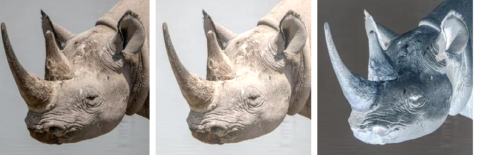
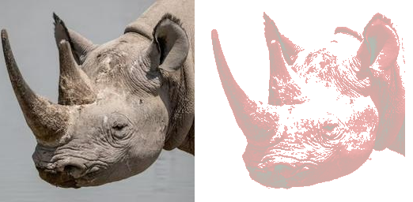

==========================
Image eval
==========================

| See: https://pillow.readthedocs.io/en/stable/reference/Image.html#PIL.Image.Image.eval

----

Eval
----------------------------

| Use the ``Image.eval(image, *args)`` method to return an image with which has each pixel evaluated by the specified function, referred to by ``*args``.
| Applies the function (which should take one integer argument) to each pixel in the given image. 
| If the image has more than one band, the same function is applied to each band. 
| Note that the function is evaluated once for each possible pixel value, so you cannot use random components.

.. code-block:: python

    from PIL import Image

    def eval_func_light(x):
        return x + 55

    def eval_func_inv(x):
        return 255 - x

    with Image.open("test_images/rhino.jpg") as im:
        im1 = Image.eval(im, eval_func_light)
        # im1.show()
        im1.save("Image/Image_eval_light.png")
        im2 = Image.eval(im, eval_func_inv)
        # im2.show()
        im2.save("Image/Image_eval_inv.png")

----

Eval for a mask
-------------------------

| The code below converts the image to greyscale then uses the eval method to create a new image, im_mask, based on its greyscale pixel levels.
| A white image, level 255, with the im_mask used as a mask as it is pasted over a new image of (178,190,181) color. 

.. code-block:: python

    def eval_mask(x):
        return x if x <= 145 else 255

    with Image.open("test_images/rhino.jpg") as im:
        im1 = im.convert("L")
        im_mask = Image.eval(im1, eval_mask)
        # mask.show()
        im1 = Image.new("RGBA", (256, 256), (178,190,181))
        im1.paste(255, im_mask)
        # im1.show()
        im1.save("Image/Image_eval_alpha.png")

    
