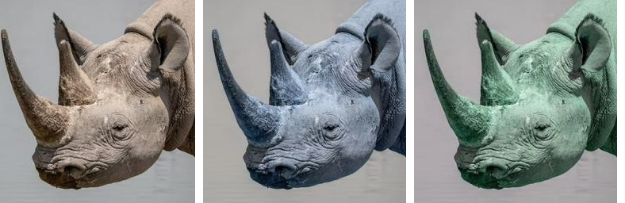
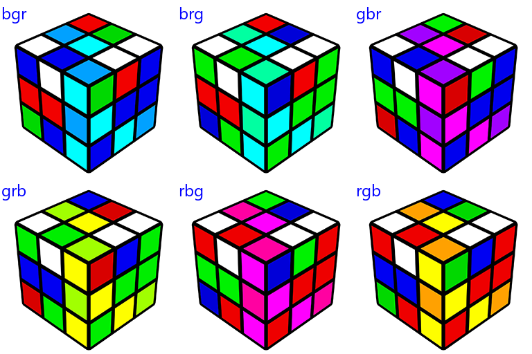

==========================
Image merge
==========================

| See: https://pillow.readthedocs.io/en/stable/reference/Image.html#PIL.Image.Image.merge

----

Merge with band swaps
----------------------------

| Use ``Image.merge(mode, bands)`` to return an image that is the merge of a set of single band images into a new multiband image.
| mode - The mode to use for the output image. e.g. RGB
| bands - A sequence containing one single-band image for each band in the output image. 
| All bands must have the same size.

| ``r, g, b = im.split()`` is used to split the image into separate bands. 
| If the image has an alpha layer, use: ``r, g, b, a = im.split()``
| ``im2 = Image.merge("RGB", (b, g, r))`` puts the blue band in the red channel, and the red band in the blue channel.
| ``im3 = Image.merge("RGB", (b, r, g))`` puts the blue band in the red channel, and the red band in the green channel, and the green band in the blue channel.

.. code-block:: python

    from PIL import Image

    with Image.open("test_images/rhino.jpg") as im:
        r, g, b = im.split()
        # im.show()
        im2 = Image.merge("RGB", (b, g, r))
        # im2.show()
        im2.save("Image/Image_merge.png")

        im3 = Image.merge("RGB", (b, r, g))
        # im3.show()
        im3.save("Image/Image_merge2.png")

    
----

Merge
----------------------------

| The 3 bands of the rubics cube are swapped around in the code below.
| ``[p for p in permutations(x)]`` produces a list of the different orders.
| [(0, 1, 2), (0, 2, 1), (1, 0, 2), (1, 2, 0), (2, 0, 1), (2, 1, 0)]
| The image is split into different channels using ``r, g, b = im.split()``.
| These are placed in a tuple, ``seq = (r, g, b)``, for retrieving later using ``seq`` indexe, such as, ``seq[x]``.
| ``bands = tuple(seq[x] for x in i)`` uses tuple comprehension to build a tuple of bands such as ``(r, g, b)``.
| ``im_new = Image.merge("RGB", bands)`` creates a new image by merging the band images in the channels r, g, b.

.. code-block:: python

    from PIL import Image, ImageFont, ImageDraw
    from itertools import permutations

    def get_perms(x):
        return [p for p in permutations(x)]

    font = ImageFont.truetype('C:/Windows/Fonts/Segoeui.ttf', 24)

    with Image.open("test_images/rcube.png") as im:
        r, g, b = im.split()
        seq = (r, g, b)
        perms = get_perms([0, 1, 2])
        rgb_str = 'rgb'
        for i in perms:
            bands_txt = "".join(str(rgb_str[x]) for x in i)
            bands = tuple(seq[x] for x in i)
            im_new = Image.merge("RGB", bands)
            draw = ImageDraw.Draw(im_new)
            text = bands_txt
            draw.text((2, 2), text=text, font=font, fill=(0, 0, 255))
            im_new.save("Image/Image_merge_" + bands_txt + ".png")

    