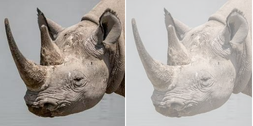
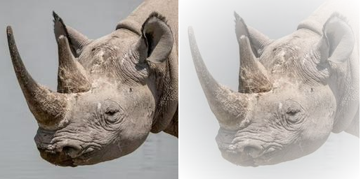

==========================
Image putalpha
==========================

| See: https://pillow.readthedocs.io/en/stable/reference/Image.html#PIL.Image.Image.putalpha

----

Putalpha
----------------------------

| Use the ``Image.putalpha(alpha)`` adds or replaces, **in place**, the alpha layer in the image. If the image does not have an alpha layer, it's converted to "LA" or "RGBA". 
| alpha - The new alpha layer. This can either be an "L" or "1" image having the same size as this image, or an integer or other color value.

----

Putalpha pixel level
----------------------------

| The code below sets the alpha level for the whole image to 128.

.. code-block:: python

    from PIL import Image, ImageChops

    with Image.open("test_images/rhino.jpg") as im:
        im.putalpha(128)
        im.save("Image/Image_putalpha_128.png")

    

----

Putalpha radial gradient
----------------------------

| The code below sets the alpha level using the inverted radial gradient.

.. code-block:: python

    from PIL import Image, ImageChops

    with Image.open("test_images/rhino.jpg") as im:
        im_alpha = ImageChops.invert(Image.radial_gradient("L"))
        im.putalpha(im_alpha)
        # im.show()
        im.save("Image/Image_putalpha_radial.png")
    

                

