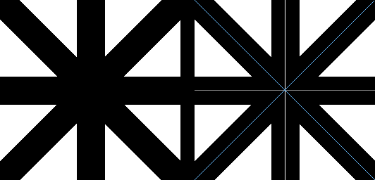

==========================
Image putpixel
==========================

| See: https://pillow.readthedocs.io/en/stable/reference/Image.html#PIL.Image.Image.putpixel

----

Putpixel
----------------------------

| Use the ``Image.putpixel(xy, value)`` modifies the pixel at the given position. 
| xy - The pixel coordinate, given as (x, y).
| value - The pixel value.
| The color is given as a single numerical value for single-band images (e.g L, greyscale), and a tuple for multi-band images (e.g RGB). In addition to this, RGB and RGBA tuples are accepted for P and PA images.
| Note that this method is relatively slow. For more extensive changes, use paste() or the ImageDraw module instead.

----

Putalpha pixel level
----------------------------

| The code below, the image is initally in black and white, 1 mode. It adds a white line down the middle.
| The image is then converted to greyscale, mode L.
 and across the middle.
| Then, it is conveted to mode RGB so that colour pixels can be added.

.. code-block:: python

    from PIL import Image

    with Image.open("test_images/crosses_bw.png") as im:
        print(im.filename, im.format, im.mode, im.size, sep="; ")
        width, height = im.size

        # add white vert line
        # pix_val = 1
        x1 = width // 2
        y_vals = range(height)
        for y in y_vals:
            im.putpixel((x1, y), pix_val )

        # add gray hor line
        im = im.convert(mode='L')
        pix_val = 125
        x_vals = range(width)
        y1 = height // 2
        for x in x_vals:
            im.putpixel((x, y1), pix_val )

        # add xshape for blue color
        im = im.convert(mode='RGB')
        pix_col = (100, 181, 246)

        x_vals = range(width)
        y_vals = range(height)
        xy_vals = zip(x_vals, y_vals)
        for x, y in xy_vals:
            im.putpixel((x, y), pix_col )

        y_vals = range(height-1, 0, -1)
        xy_vals = zip(x_vals, y_vals)
        for x, y in xy_vals:
            im.putpixel((x, y), pix_col )

        # im.show()
        im.save("image/Image_putpixel.png")
    

