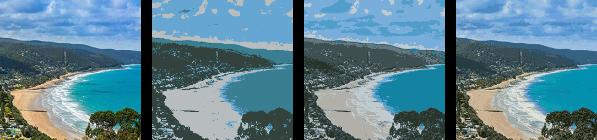
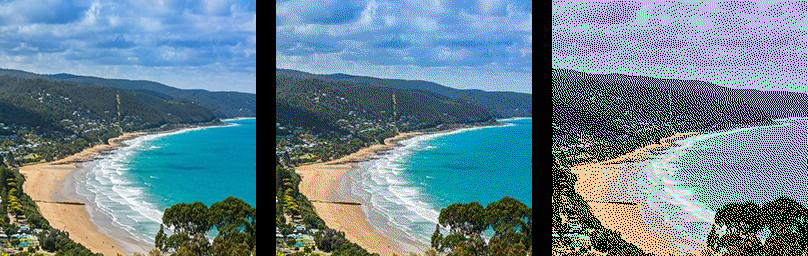

==========================
Image quantize
==========================

| See: https://pillow.readthedocs.io/en/stable/reference/Image.html#PIL.Image.Image.quantize

----

Quantize 
----------------------------

| Use theImage.quantize(colors=256, method=None, kmeans=0, palette=None, dither=Dither.FLOYDSTEINBERG) to return an image converted to P mode with the specified number of colors.
| colors - The desired number of colors, <= 256
| method - Quantize.MEDIANCUT (median cut), Quantize.MAXCOVERAGE (maximum coverage), Quantize.FASTOCTREE (fast octree), Quantize.LIBIMAGEQUANT (libimagequant; check support using PIL.features.check_feature() with feature="libimagequant").
| By default, Quantize.MEDIANCUT will be used.
| The exception to this is RGBA images. Quantize.MEDIANCUT and Quantize.MAXCOVERAGE do not support RGBA images, so Quantize.FASTOCTREE is used by default instead.
| kmeans - Integer
| palette - Quantize to the palette of a given Image.
| dither - Dithering method, used when converting from mode "RGB" to "P" or from "RGB" or "L" to "1". Available methods are Dither.NONE or Dither.FLOYDSTEINBERG (default).

----

Quantize number of colours
------------------------------

| The code below produces a series of images converted to P mode with the specified number of colors.

.. code-block:: python

    from PIL import Image

    with Image.open("test_images/lorne.jpg") as im:
        im1 = im.quantize(colors=4)
        im1.save("Image/image_quantize4.png")
        im1 = im.quantize(colors=8)
        im1.save("Image/image_quantize8.png")
        im1 = im.quantize(colors=32)
        im1.save("Image/image_quantize32.png")

    

----

Quantize by image palette
------------------------------

| The code below produces an image converted to P mode with the specified image palette.

| The code below.

.. code-block:: python

    from PIL import Image

    with Image.open("new_images/draw_palette_4.png") as im:
        im_pal1 = im.convert(mode="P", palette=Image.Palette.WEB)

    with Image.open("new_images/draw_palette5.png") as im:
        im_pal2 = im.convert(mode="P", palette=Image.Palette.ADAPTIVE)

    with Image.open("test_images/lorne.jpg") as im:
        im1 = im.quantize(palette=im_pal1)
        im1.save("Image/image_quantize_im_pal.png")
        im2 = im.quantize(palette=im_pal2)
        im2.save("Image/image_quantize_im_pal2.png")

