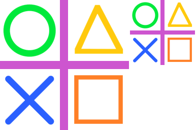
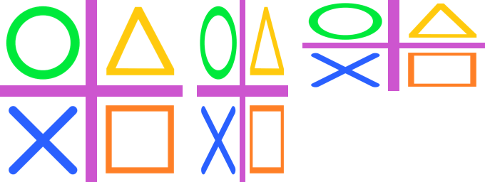

==========================
Image reduce
==========================

| See: https://pillow.readthedocs.io/en/stable/reference/Image.html#PIL.Image.Image.reduce

----

Reduce 
----------------------------

| Use the ``Image.reduce(factor, box=None)`` method to return a copy of the image reduced factor times. If the size of the image is not dividable by factor, the resulting size will be rounded up.
| factor - An integer > 0  or tuple of two integers for factors in width and in height.
| box - An optional 4-tuple of ints providing the source image region to be reduced. The values must be within (0, 0, width, height) rectangle. If omitted or None, the entire source is used.

----

Reduce by 2
----------------------------

| The code below reduces the image size by a factor of 2 in each direction.

.. code-block:: python

    from PIL import Image

    with Image.open("test_images/shapes.png") as im:
        im_new = im.reduce(2)
        im_new.save("Image/image_reduce_2.png")

    
----

Reduce by different factors
----------------------------

.. code-block:: python

    from PIL import Image

    with Image.open("test_images/shapes.png") as im:
        factors = (2, 1)
        im_new = im.reduce(factors)
        im_new.save("Image/image_reduce_2by1.png")

        factors = (1, 2)
        im_new = im.reduce(factors)
        im_new.save("Image/image_reduce_1by2.png")

