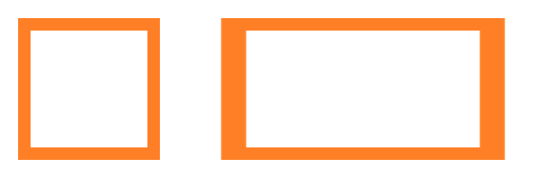
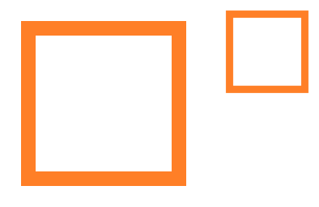
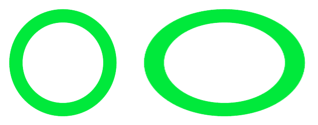
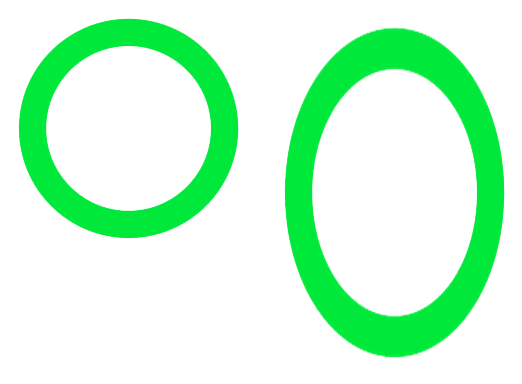

==========================
Image resize
==========================

| See: https://pillow.readthedocs.io/en/stable/reference/Image.html#PIL.Image.Image.resize

----

Resize
----------

| Use the ``resize(size, resample=None, box=None, reducing_gap=None)`` method to return a resized image.
| size - The requested size in pixels, as a 2-tuple: (width, height).
| resample - An optional resampling filter. This can be one of Resampling.NEAREST, Resampling.BOX, Resampling.BILINEAR, Resampling.HAMMING, Resampling.BICUBIC or Resampling.LANCZOS. If the image has mode “1” or “P”, it is always set to Resampling.NEAREST. If the image mode specifies a number of bits, such as “I;16”, then the default filter is Resampling.NEAREST. Otherwise, the default filter is Resampling.BICUBIC. See: Filters.
| box - An optional 4-tuple of floats providing the source image region to be scaled. The values must be within (0, 0, width, height) rectangle. If omitted or None, the entire source is used.
| reducing_gap - Apply optimization by resizing the image in two steps. First, reducing the image by integer times using reduce(). Second, resizing using regular resampling. The last step changes size no less than by reducing_gap times. reducing_gap may be None (no first step is performed) or should be greater than 1.0. The bigger reducing_gap, the closer the result to the fair resampling. The smaller reducing_gap, the faster resizing. With reducing_gap greater or equal to 3.0, the result is indistinguishable from fair resampling in most cases. The default value is None (no optimization).

----

Resize to a specific size
----------------------------

| The code below resizes an image and saves it with another name.
| The box image is has a width of 256 and height of 256.
| The box image is resized to have a width of 400 and height of 300, and is saved as **rect.png**.

.. code-block:: python

    from PIL import Image

    with Image.open("shapes/box.png") as im:
        newsize = (400, 300)
        im_new = im.resize(newsize)
        im_new.save("shapes/rect_400_300.png")

    
----

Resize to a specific ratio
----------------------------

| The code below resizes an image to half the size and saves it with another name.

.. code-block:: python

    from PIL import Image

    with Image.open("shapes/box.png") as im:
        # halve the width and height
        (width, height) = (im.width // 2, im.height // 2)
        im_new = im.resize((width, height))
        im_new.save("shapes/box_half.png")

    
----

Stretch by a specific ratio
----------------------------

| The code below stretches the image horizontally.
| The new saved file includes the stretch factor in its file name.

.. code-block:: python

    from PIL import Image

    with Image.open("shapes/o.png") as im:
        hor_stretch = 1.5
        (width, height) = (int(im.width * hor_stretch), im.height)
        im_new = im.resize((width, height))
        im_new.save("shapes/o_hor_stretch" + str(hor_stretch) + ".png")

    

| The code below stretches the image vertically.
| The new saved file includes the stretch factor in its file name.

.. code-block:: python

    from PIL import Image

    with Image.open("shapes/o.png") as im:
        vert_stretch = 1.5
        (width, height) = (im.width, int(im.height * vert_stretch))
        im_new = im.resize((width, height))
        im_new.save("shapes/o_vert_stretch" + str(vert_stretch) + ".png")

    
----

Resize a box area
-------------------

| The **box=(left, top, right, bottom)** parameter can be used to rezise part of an image.
| The code below takes a the top left quarter are resizes to the same of the whole image.

.. code-block:: python

    from PIL import Image

    with Image.open("shapes/o.png") as im:
        (curr_width, curr_height) = (im.width, im.height)
        (width, height) = (im.width // 2, im.height // 2)
        box_to_resize = (0, 0, width, height)
        im_new = im.resize((curr_width, curr_height), box=box_to_resize)
        im_new.save("shapes/o_arc.png")

    

