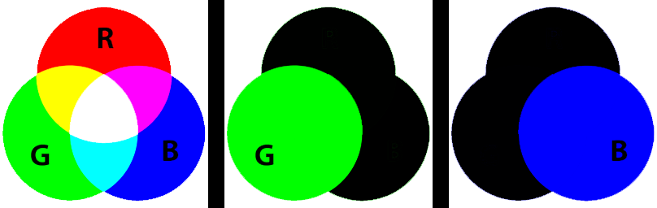

==========================
Image split
==========================

| See: https://pillow.readthedocs.io/en/stable/reference/Image.html#PIL.Image.Image.split

----

Split
----------------------------

| Use the ``Image.split()`` method to split the image into individual bands (channels) and return a tuple of individual image bands. 
| For example, splitting an RGB image creates three new images each containing a copy of one of the original bands (red, green, blue).
| If you need only one band, getchannel() method can be more convenient and faster.

| ``r, g, b = im.split()`` is used to split an RGB image into separate bands. 
| ``r, g, b, a = im.split()`` is used to split an RGBA image into separate bands. 

----

Merging split bands
---------------------------

| The code below splits the image into bands then uses those bands to create a new image.

.. code-block:: python

    from PIL import Image

    with Image.open("test_images/rgb_colors.png") as im:
        r, g, b, a = im.split()
        bl = Image.new("L", im.size, 0)

        im_r = Image.merge("RGBA", (r, bl, bl, a))
        im_r.save("image/image_split_r.png")

        im_b = Image.merge("RGBA", (bl, bl, b, a))
        im_b.save("image/image_split_b.png")
        

