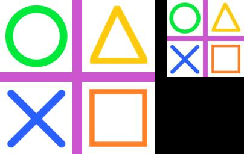

==========================
Image thumbnail
==========================

| See: https://pillow.readthedocs.io/en/stable/reference/Image.html#PIL.Image.Image.thumbnail

----

Thumbnail
----------------------------

| Use the ``Image.thumbnail(size, resample=Resampling.BICUBIC, reducing_gap=2.0)`` method to make an image into a thumbnail, no larger than the given size. This method calculates an appropriate thumbnail size to preserve the aspect of the image, and resizes the image **in place.**
| If you need to use the full resolution image as well, apply this method to a copy() of the original image.
| size - Requested size.
| resample - Optional resampling filter. This can be one of Resampling.NEAREST, Resampling.BOX, Resampling.BILINEAR, Resampling.HAMMING, Resampling.BICUBIC or Resampling.LANCZOS. If omitted, it defaults to Resampling.BICUBIC.
| reducing_gap - Apply optimization by resizing the image in two steps. First, reducing the image by integer times using reduce() or draft() for JPEG images. Second, resizing using regular resampling. The last step changes size no less than by reducing_gap times. reducing_gap may be None (no first step is performed) or should be greater than 1.0. The bigger reducing_gap, the closer the result to the fair resampling. The smaller reducing_gap, the faster resizing. With reducing_gap greater or equal to 3.0, the result is indistinguishable from fair resampling in most cases. The default value is 2.0 (very close to fair resampling while still being faster in many cases)

----

Make thumbnail of copy
-----------------------

| The code below copies an image then makes a thumbnail which is saved to a new file.

.. code-block:: python

    from PIL import Image

    with Image.open("test_images/shapes.jpg") as im_orig:
        im = im_orig.copy()
        thumb_size = (128, 128)
        im.thumbnail(thumb_size)
        im.save("image/thumbnail.jpg")

